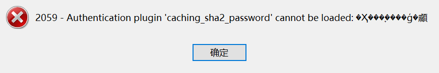
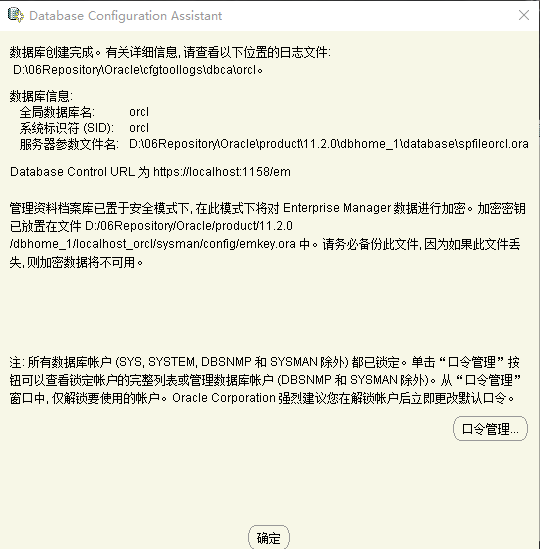
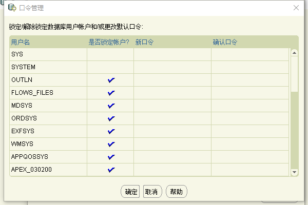
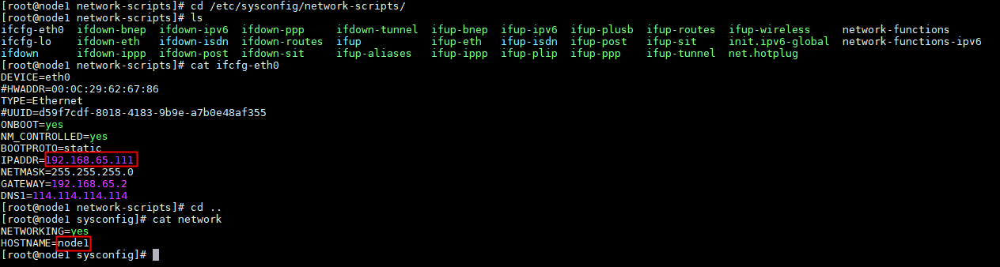
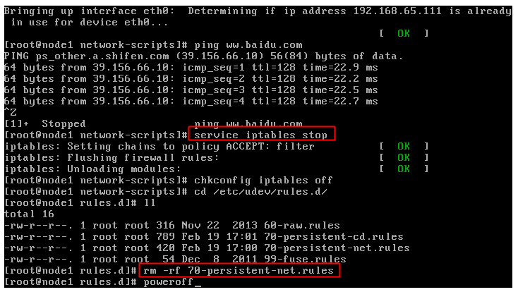
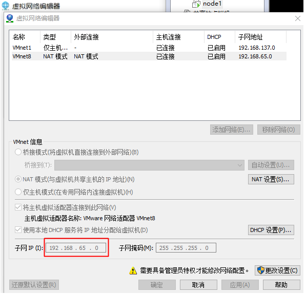

​	软件开发的工具众多，给人的感觉总是“工欲善其事，必先利其器”。除此之外软件等相关工具的资源寻找、安装、使用等相关疑难杂症总是特别耗时的，私以为这些工作是不需要思考的，同时也想整理一下这些资源，以备需要的时候同样的坑再踩一次。

# JDK

## **oracle地址**

<https://www.oracle.com/cn/java/>

## **oracle账密**

<https://bugmenot.com/view/oracle.com>

## **环境变量**

```
## JDK
JAVA_HOME  C:\Program Files\Java\jdk1.8.0_131

## java5以及以后的java版本都不需要再设置了
CLASSPATH  %JAVA_HOME%\lib;%JAVA_HOME%\lib\tools.jar

Path %JAVA_HOME%\bin
Path %JAVA_HOME%\jre\bin
## 测试安装
java -version
```


系统变量→新建JAVA_HOME变量 

```bash
JAVA_HOME  C:\Program Files\Java\jdk1.8.0_121
```

系统变量→寻找Path变量→编辑

```
Path  %JAVA_HOME%\bin;%JAVA_HOME%\jre\bin;
```

系统变量→新建[CLASS](https://product.pconline.com.cn/itbk/digital/ydcc/1107/2482198.html)PATH变量（1.5之后不需要）

```
CLASSPATH  .;%JAVA_HOME%\lib;%JAVA_HOME%\lib\tools.jar  
```

安装配置检查

cmd 命令行窗口执行

```
java -version
```

## 下载地址

https://java-decompiler.github.io/

https://www.oracle.com/cn/

ava jdk 国内下载镜像地址

（1）TUNA镜像 <https://mirrors.tuna.tsinghua.edu.cn/Adoptium/>

（2）HUAWEI镜像 <https://repo.huaweicloud.com/java/jdk/>

（3）injdk <https://d.injdk.cn/download/openjdk>

其他地址：

（1) [https://openjdk.java.net](https://openjdk.java.net/)

  (2) <https://jdk.java.net/archive/>

（3）<https://github.com/openjdk/jdk>

<https://blog.csdn.net/wolf_love666/article/details/79787735>

<https://docs.oracle.com/javase/specs/index.html>

<https://blog.csdn.net/aijiudu/article/details/72991993>

<https://zhuanlan.zhihu.com/p/358982943>

https://www.jcp.org/en/home/index

# Maven

## **安装包下载**

<https://maven.apache.org/download.cgi>

## **环境变量**

```
## 配置环境变量
MAVEN_HOME C:\Program Files\apache-maven-3.6.3
Path %MAVEN_HOME%\bin

## 测试安装
mvn -v
```

## **阿里云的镜像库**

```
<mirrors>
     <mirror>
          <id>aliyunmaven</id>
          <mirrorOf>*</mirrorOf>
          <name>阿里云公共仓库</name>
          <url>https://maven.aliyun.com/repository/public</url>
     </mirror>
</mirrors>
```

高级系统设置–>环境变量->编辑变量Path

```
-- 新建变量
MAVEN_HOME C:\Program Files\apache-maven-3.5.4

-- path添加安装路径
%MAVEN_HOME%\bin

-- 然后win+R运行cmd，输入
mvn -version
```

[Maven安装和配置&详细步骤](https://blog.csdn.net/weixin_56800176/article/details/127949796)

```xml
<?xml version="1.0" encoding="UTF-8"?>

<!--
Licensed to the Apache Software Foundation (ASF) under one
or more contributor license agreements.  See the NOTICE file
distributed with this work for additional information
regarding copyright ownership.  The ASF licenses this file
to you under the Apache License, Version 2.0 (the
"License"); you may not use this file except in compliance
with the License.  You may obtain a copy of the License at

    http://www.apache.org/licenses/LICENSE-2.0

Unless required by applicable law or agreed to in writing,
software distributed under the License is distributed on an
"AS IS" BASIS, WITHOUT WARRANTIES OR CONDITIONS OF ANY
KIND, either express or implied.  See the License for the
specific language governing permissions and limitations
under the License.
-->

<!--
 | This is the configuration file for Maven. It can be specified at two levels:
 |
 |  1. User Level. This settings.xml file provides configuration for a single user,
 |                 and is normally provided in ${user.home}/.m2/settings.xml.
 |
 |                 NOTE: This location can be overridden with the CLI option:
 |
 |                 -s /path/to/user/settings.xml
 |
 |  2. Global Level. This settings.xml file provides configuration for all Maven
 |                 users on a machine (assuming they're all using the same Maven
 |                 installation). It's normally provided in
 |                 ${maven.conf}/settings.xml.
 |
 |                 NOTE: This location can be overridden with the CLI option:
 |
 |                 -gs /path/to/global/settings.xml
 |
 | The sections in this sample file are intended to give you a running start at
 | getting the most out of your Maven installation. Where appropriate, the default
 | values (values used when the setting is not specified) are provided.
 |
 |-->
<settings xmlns="http://maven.apache.org/SETTINGS/1.0.0"
          xmlns:xsi="http://www.w3.org/2001/XMLSchema-instance"
          xsi:schemaLocation="http://maven.apache.org/SETTINGS/1.0.0 http://maven.apache.org/xsd/settings-1.0.0.xsd">
  <!-- localRepository
   | The path to the local repository maven will use to store artifacts.
   |
   | Default: ${user.home}/.m2/repository
  <localRepository>/path/to/local/repo</localRepository>
  -->
  <localRepository>D:\03Repository</localRepository>

  <!-- interactiveMode
   | This will determine whether maven prompts you when it needs input. If set to false,
   | maven will use a sensible default value, perhaps based on some other setting, for
   | the parameter in question.
   |
   | Default: true
  <interactiveMode>true</interactiveMode>
  -->

  <!-- offline
   | Determines whether maven should attempt to connect to the network when executing a build.
   | This will have an effect on artifact downloads, artifact deployment, and others.
   |
   | Default: false
  <offline>false</offline>
  -->

  <!-- pluginGroups
   | This is a list of additional group identifiers that will be searched when resolving plugins by their prefix, i.e.
   | when invoking a command line like "mvn prefix:goal". Maven will automatically add the group identifiers
   | "org.apache.maven.plugins" and "org.codehaus.mojo" if these are not already contained in the list.
   |-->
  <pluginGroups>
    <!-- pluginGroup
     | Specifies a further group identifier to use for plugin lookup.
    <pluginGroup>com.your.plugins</pluginGroup>
    -->
  </pluginGroups>

  <!-- proxies
   | This is a list of proxies which can be used on this machine to connect to the network.
   | Unless otherwise specified (by system property or command-line switch), the first proxy
   | specification in this list marked as active will be used.
   |-->
  <proxies>
    <!-- proxy
     | Specification for one proxy, to be used in connecting to the network.
     |
    <proxy>
      <id>optional</id>
      <active>true</active>
      <protocol>http</protocol>
      <username>proxyuser</username>
      <password>proxypass</password>
      <host>proxy.host.net</host>
      <port>80</port>
      <nonProxyHosts>local.net|some.host.com</nonProxyHosts>
    </proxy>
    -->
  </proxies>

  <!-- servers
   | This is a list of authentication profiles, keyed by the server-id used within the system.
   | Authentication profiles can be used whenever maven must make a connection to a remote server.
   |-->
  <servers>
    <!-- server
     | Specifies the authentication information to use when connecting to a particular server, identified by
     | a unique name within the system (referred to by the 'id' attribute below).
     |
     | NOTE: You should either specify username/password OR privateKey/passphrase, since these pairings are
     |       used together.
     |
    <server>
      <id>deploymentRepo</id>
      <username>repouser</username>
      <password>repopwd</password>
    </server>
    -->

    <!-- Another sample, using keys to authenticate.
    <server>
      <id>siteServer</id>
      <privateKey>/path/to/private/key</privateKey>
      <passphrase>optional; leave empty if not used.</passphrase>
    </server>
    -->
  </servers>

  <!-- mirrors
   | This is a list of mirrors to be used in downloading artifacts from remote repositories.
   |
   | It works like this: a POM may declare a repository to use in resolving certain artifacts.
   | However, this repository may have problems with heavy traffic at times, so people have mirrored
   | it to several places.
   |
   | That repository definition will have a unique id, so we can create a mirror reference for that
   | repository, to be used as an alternate download site. The mirror site will be the preferred
   | server for that repository.
   |-->
  <mirrors>
    <!-- mirror
     | Specifies a repository mirror site to use instead of a given repository. The repository that
     | this mirror serves has an ID that matches the mirrorOf element of this mirror. IDs are used
     | for inheritance and direct lookup purposes, and must be unique across the set of mirrors.
     |
    <mirror>
      <id>mirrorId</id>
      <mirrorOf>repositoryId</mirrorOf>
      <name>Human Readable Name for this Mirror.</name>
      <url>http://my.repository.com/repo/path</url>
    </mirror>
     -->
	<mirror>
      <id>mirrorId</id>
      <mirrorOf>central</mirrorOf>
      <name>Human Readable Name for this Mirror.</name>
      <url>http://central.maven.org/maven2/</url>
    </mirror>
    <mirror>
      <id>mirrorId</id>
      <mirrorOf>repositoryId</mirrorOf>
      <name>Human Readable Name for this Mirror.</name>
      <url>http://my.repository.com/repo/path</url>
    </mirror>
	<mirror>
		 <id>alimaven</id>
		<name>aliyun maven</name>
		<url>http://maven.aliyun.com/nexus/content/groups/public/</url>
		<mirrorOf>central</mirrorOf>
	</mirror>
	<mirror>


	<!-- 这里使用的是阿里的远程maven镜像，目前国内大多数都使用它 -->
	<mirror>
		 <id>alimaven</id>
		<name>aliyun maven</name>
		<url>http://maven.aliyun.com/nexus/content/groups/public/</url>
		<mirrorOf>central</mirrorOf>
	</mirror>
	
  </mirrors>

  <!-- profiles
   | This is a list of profiles which can be activated in a variety of ways, and which can modify
   | the build process. Profiles provided in the settings.xml are intended to provide local machine-
   | specific paths and repository locations which allow the build to work in the local environment.
   |
   | For example, if you have an integration testing plugin - like cactus - that needs to know where
   | your Tomcat instance is installed, you can provide a variable here such that the variable is
   | dereferenced during the build process to configure the cactus plugin.
   |
   | As noted above, profiles can be activated in a variety of ways. One way - the activeProfiles
   | section of this document (settings.xml) - will be discussed later. Another way essentially
   | relies on the detection of a system property, either matching a particular value for the property,
   | or merely testing its existence. Profiles can also be activated by JDK version prefix, where a
   | value of '1.4' might activate a profile when the build is executed on a JDK version of '1.4.2_07'.
   | Finally, the list of active profiles can be specified directly from the command line.
   |
   | NOTE: For profiles defined in the settings.xml, you are restricted to specifying only artifact
   |       repositories, plugin repositories, and free-form properties to be used as configuration
   |       variables for plugins in the POM.
   |
   |-->
  <profiles>
    <!-- profile
     | Specifies a set of introductions to the build process, to be activated using one or more of the
     | mechanisms described above. For inheritance purposes, and to activate profiles via <activatedProfiles/>
     | or the command line, profiles have to have an ID that is unique.
     |
     | An encouraged best practice for profile identification is to use a consistent naming convention
     | for profiles, such as 'env-dev', 'env-test', 'env-production', 'user-jdcasey', 'user-brett', etc.
     | This will make it more intuitive to understand what the set of introduced profiles is attempting
     | to accomplish, particularly when you only have a list of profile id's for debug.
     |
     | This profile example uses the JDK version to trigger activation, and provides a JDK-specific repo.
    <profile>
      <id>jdk-1.4</id>

      <activation>
        <jdk>1.4</jdk>
      </activation>

      <repositories>
        <repository>
          <id>jdk14</id>
          <name>Repository for JDK 1.4 builds</name>
          <url>http://www.myhost.com/maven/jdk14</url>
          <layout>default</layout>
          <snapshotPolicy>always</snapshotPolicy>
        </repository>
      </repositories>
    </profile>
    -->

    <!--
     | Here is another profile, activated by the system property 'target-env' with a value of 'dev',
     | which provides a specific path to the Tomcat instance. To use this, your plugin configuration
     | might hypothetically look like:
     |
     | ...
     | <plugin>
     |   <groupId>org.myco.myplugins</groupId>
     |   <artifactId>myplugin</artifactId>
     |
     |   <configuration>
     |     <tomcatLocation>${tomcatPath}</tomcatLocation>
     |   </configuration>
     | </plugin>
     | ...
     |
     | NOTE: If you just wanted to inject this configuration whenever someone set 'target-env' to
     |       anything, you could just leave off the <value/> inside the activation-property.
     |
    <profile>
      <id>env-dev</id>

      <activation>
        <property>
          <name>target-env</name>
          <value>dev</value>
        </property>
      </activation>

      <properties>
        <tomcatPath>/path/to/tomcat/instance</tomcatPath>
      </properties>
    </profile>
    -->
  </profiles>

  <!-- activeProfiles
   | List of profiles that are active for all builds.
   |
  <activeProfiles>
    <activeProfile>alwaysActiveProfile</activeProfile>
    <activeProfile>anotherAlwaysActiveProfile</activeProfile>
  </activeProfiles>
  -->
</settings>
```

# Git

```bash
-- 用户名标识 (实际也可以填写您的github仓库的名称)
git config --global user.name "zhuph"
-- 邮箱标识 (可以填写github仓库的邮箱)
git config --global user.email "1038190357@qq.com"  
-- 创建秘钥
ssh-keygen -t rsa
-- 生成文件路径
C:\Users\Zhuph\.ssh\id_rsa.pub
```

[Git安装教程](https://www.cnblogs.com/hdlan/p/14395189.html)

[Git连接github仓库](https://www.cnblogs.com/hdlan/p/14395681.html)

## **账户信息**

### 全局配置

git config --global --list

### 仓库配置

### 配置用户名

git config --global user.name "zhuph"

### 配置邮箱 

git config --global user.email "zhuph@qq.com.cn"

##生存秘钥对
ssh-keygen -t rsa 

##公钥
C:\Users\zhuph\.ssh\id_rsa.pub

## **代码统计**

git log --author="zhuph"  --since=2022-04-13 --until=2025-10-25 --pretty=tformat: --numstat | awk '{ add += $1; subs += $2; loc += $1 - $2 } END { printf "added lines: %s, removed lines: %s, total lines: %s\n", add, subs, loc }' -

# MySQL

**1. 下载**

[MySQL下载地址](https://dev.mysql.com/) 

[mysql数据库安装指南](https://zhuanlan.zhihu.com/p/37152572)

**2. 配置环境变量**

系统变量→寻找Path变量→编辑

```
C:\Program Files\MySQL\MySQL Server 8.0\bin
```

**3. 连接客户端问题**

mysql8 之前的版本中加密规则是mysql_native_password,而在mysql8之后,加密规则是caching_sha2_password



修改加密规则

```
1、登录Mysql：

mysql -u root -p

2、修改账户密码加密规则并更新用户密码

// 修改加密规则（可以直接复制）
ALTER USER 'root'@'localhost' IDENTIFIED BY 'password' PASSWORD EXPIRE NEVER;
// 更新一下用户的密码（可以直接复制）
ALTER USER 'root'@'localhost' IDENTIFIED WITH mysql_native_password BY 'password';

3、刷新权限并重置密码

// 刷新权限（可以直接复制）
FLUSH PRIVILEGES;

4、重置密码

//此处请自定义密码，红色的root就是博主自定义的密码
alter user 'root'@'localhost' identified by 'root';

此处将密码改为root


```

1.编译安装  2. rpm redcat package management 3. yum 4. 压缩包

# Node

**1. 修改npm配置路径**

**查看当前npm的配置环境**

npm config ls

**修改路径 module、cache** 

mkdir E:\nodejs\node_modules\npm\node_global_modules 
mkdir E:\nodejs\node_modules\npm\node_cache

**2. 修改路径**

module对应prefix，cache对应cache

D:\03Repository\node_modules\npm\node_cache

npm config set prefix "D:\03Repository\node_modules\npm\node_global_modules" 
npm config set cache "D:\03Repository\node_modules\npm\node_cache"

# Oracle

管理口令 确认口令 zhuph123






https://localhost:1158/em

## **Fiddler**

[Fiddler Everywhere for Windows](https://www.telerik.com/download/fiddler/fiddler-everywhere-windows)

[Wireshark、Burpsuite、Charles三大抓包神器抓取https明文-腾讯云开发者社区-腾讯云](https://cloud.tencent.com/developer/article/1875746)

Xmind

[XMind ZEN v10.3.1绿色版.7z - 蓝奏云](https://lcllfj.lanzoui.com/iA9dtuzvn6f)

Google离线版

<https://www.google.cn/chrome/next-steps.html?extra=stablechannel&platform=win64&standalone=1&statcb=0&installdataindex=empty&defaultbrowser=0>

RESP

[redis/RedisDesktopManager](https://github.com/redis/RedisDesktopManager)

[Redis Insight](https://redis.io/insight/)

HBuiler

[HBuilderX-高效极客技巧](https://www.dcloud.io/hbuilderx.html)

EditPlus

用户名：Vovan 学习码：3AG46-JJ48E-CEACC-8E6EW-ECUAW

[EditPlus](https://www.lanzoux.com/b0f1hq5fa)

### 镜像

<https://github.moeyy.xyz/>

<https://www.cnblogs.com/ting1/p/18356265>

[ 清华大学开源软件镜像站](https://mirrors.tuna.tsinghua.edu.cn/)

<https://mirrors.tuna.tsinghua.edu.cn/github-release/>

https://redis.io/insight/

# MacOS

# Linux

## VMware








