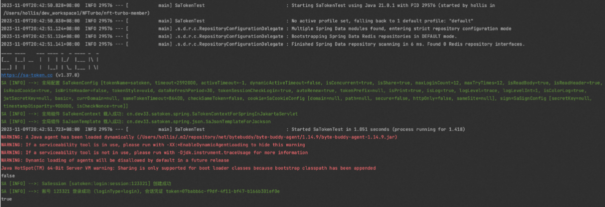

# Sa-Token

https://sa-token.cc/

Sa-Token 是一个轻量级的 Java 权限认证框架，旨在提供简单、高效、安全的权限管理功能。它的设计目标是简化权限管理的复杂性，同时保持灵活性和扩展性，适用于各种 Java 应用程序，包括 Web 应用、微服务和单体应用。

1、引入配置

```
<dependency>
    <groupId>cn.dev33</groupId>
    <artifactId>sa-token-spring-boot3-starter</artifactId>
    <version>1.37.0</version>
</dependency>
```

因为我们的 SpringBoot 用的是3.0的版本，所以这里需要引入sa-token-spring-boot3-starter。

2、增加配置

```
############## Sa-Token 配置 (文档: https://sa-token.cc) ##############
sa-token: 
    # token 名称（同时也是 cookie 名称）
    token-name: satoken
    # token 有效期（单位：秒） 默认30天，-1 代表永久有效
    timeout: 2592000
    # token 最低活跃频率（单位：秒），如果 token 超过此时间没有访问系统就会被冻结，默认-1 代表不限制，永不冻结
    active-timeout: -1
    # 是否允许同一账号多地同时登录 （为 true 时允许一起登录, 为 false 时新登录挤掉旧登录）
    is-concurrent: true
    # 在多人登录同一账号时，是否共用一个 token （为 true 时所有登录共用一个 token, 为 false 时每次登录新建一个 token）
    is-share: true
    # token 风格（默认可取值：uuid、simple-uuid、random-32、random-64、random-128、tik）
    token-style: uuid
    # 是否输出操作日志 
    is-log: true
```

3、写单元测试

```
import cn.dev33.satoken.stp.StpUtil;
import cn.hollis.NFTurbo.NfTurboApplication;
import org.junit.Assert;
import org.junit.Test;
import org.junit.runner.RunWith;
import org.springframework.boot.test.context.SpringBootTest;
import org.springframework.test.context.junit4.SpringRunner;

@RunWith(SpringRunner.class)
@SpringBootTest(classes = {NfTurboApplication.class})
public class SaTokenTest {
    @Test
    public void test() {
        System.out.println(StpUtil.isLogin());
        Assert.assertFalse(StpUtil.isLogin());

        StpUtil.login(123321);

        System.out.println(StpUtil.isLogin());
        Assert.assertTrue(StpUtil.isLogin());
    }
}
```



## 