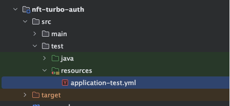

# H2内存数据库

H2 是一个开源的轻量级 Java 内存数据库，适用于开发、测试和嵌入式使用场景。它具有高性能、易用性和丰富的功能特性，支持内存模式和持久化模式。

1、引入依赖

```xml
<dependency>
    <groupId>com.h2database</groupId>
    <artifactId>h2</artifactId>
    <version>1.4.200</version>
    <scope>test</scope>
</dependency>
```

2、新增application-test.yml在测试的 classpach 下：



```yaml
spring:
  datasource:
    url: jdbc:h2:mem:nfturbo
    username: sa
    password: password
    driver-class-name: org.h2.Driver
    h2-console-setting: INIT=RUNSCRIPT FROM 'classpath:schema.sql'
```

3、schema.sql文件配置：

```sql
CREATE TABLE IF NOT EXISTS users (
    id INT AUTO_INCREMENT PRIMARY KEY,
    USER_NAME VARCHAR(255) NOT NULL
);
```

4、写单测验证

```
package cn.hollis.nft.turbo.test;

import cn.hollis.nft.turbo.member.infrastructure.mapper.UserMapper;
import org.junit.Test;
import org.springframework.beans.factory.annotation.Autowired;

@ActiveProfiles("test")
public class MybatisTest extends BaseTest {

    @Autowired
    private UserMapper userMapper;

    @Test
    public void testMybatis() {
        userMapper.findById(1L);
    }
}
```