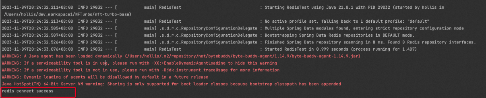

# Redis

1、依赖引入

```
<dependency>
    <groupId>org.springframework.boot</groupId>
    <artifactId>spring-boot-starter-data-redis</artifactId>
</dependency>
```

2、增加配置

```
spring:
  data:
    redis:
      host: r-xxxx.redis.rds.aliyuncs.com #Redis的Host
      port: 6379 # Redis服务器连接端口
      password: xxxx # Redis服务器连接密码（默认为空）
```

3、单元测试

```
import cn.hollis.NFTurbo.NfTurboApplication;
import org.junit.Test;
import org.junit.runner.RunWith;
import org.springframework.beans.factory.annotation.Autowired;
import org.springframework.boot.test.context.SpringBootTest;
import org.springframework.data.redis.core.RedisTemplate;
import org.springframework.test.context.junit4.SpringRunner;

@RunWith(SpringRunner.class)
@SpringBootTest(classes = {NfTurboApplication.class})
public class RedisTest {
    @Autowired
    private RedisTemplate redisTemplate;

    @Test
    public void testRedisConnect() {

        redisTemplate.opsForValue().set("test", "test");
    	Assert.assertTrue(redisTemplate.opsForValue().get("test").equals("test"));
        
        if (redisTemplate.opsForValue().get("test").equals("test")) {
            System.out.println("redis connect success");
        }
    }
}
```


```
<dependency>
    <groupId>junit</groupId>
    <artifactId>junit</artifactId>
    <version>4.13.1</version>
    <scope>test</scope>
</dependency>

<dependency>
    <groupId>org.springframework</groupId>
    <artifactId>spring-test</artifactId>
    <version>6.0.8</version>
    <scope>test</scope>
</dependency>

<dependency>
    <groupId>org.springframework.boot</groupId>
    <artifactId>spring-boot-test</artifactId>
    <version>3.1.5</version>
    <scope>test</scope>
</dependency>

<dependency>
    <groupId>org.springframework.boot</groupId>
    <artifactId>spring-boot-starter-test</artifactId>
    <scope>test</scope>
</dependency>	
```



# Redisson

```
<!--    Redisson    -->
<dependency>
    <groupId>org.redisson</groupId>
    <artifactId>redisson-spring-boot-starter</artifactId>
    <version>3.24.3</version>
</dependency>
```

增加配置

```
spring:
  redis:
    redisson:
      config: |
        singleServerConfig:
          idleConnectionTimeout: 10000
          connectTimeout: 10000
          timeout: 3000
          retryAttempts: 3
          retryInterval: 1500
          password: 'NFTurbo666'
          subscriptionsPerConnection: 5
          clientName: null
          address: "redis://r-xxxx.redis.rds.aliyuncs.com:6379"
          subscriptionConnectionMinimumIdleSize: 1
          subscriptionConnectionPoolSize: 50
          connectionMinimumIdleSize: 24
          connectionPoolSize: 64
          database: 0
          dnsMonitoringInterval: 5000
        threads: 16
        nettyThreads: 32
        codec: !<org.redisson.codec.JsonJacksonCodec> {}
        transportMode: "NIO"
```

## 