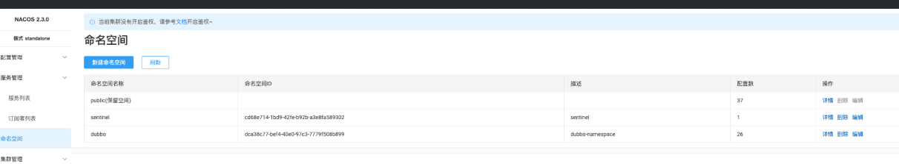

# Dubbo

这里主要是说在代码中如何把 dubbo 依赖进来，关于 dubbo 的注册中心的搭建参考：Nacos部署

1、增加pom依赖

```
<!--   dubbo   -->
<dependency>
    <groupId>org.apache.dubbo</groupId>
    <artifactId>dubbo-spring-boot-starter</artifactId>
    <version>3.2.10</version>
</dependency>

<dependency>
    <groupId>org.apache.dubbo</groupId>
    <artifactId>dubbo-registry-nacos</artifactId>
    <version>3.2.10</version>
</dependency>
```

2、增加yml配置：

```
dubbo:
  consumer:
    timeout: 3000
    check: false
  protocol:
    name: dubbo
    port: -1
  registry:
    address: nacos://114.xx.xx.45:8848
    parameters:
      namespace: dca38c77-bef4-40e0-97c3-7779f508b899
      group: dubbo
  application:
    name: ${spring.application.name}
    qos-enable: true
    qos-accept-foreign-ip: false
```

这里主要是增加一些关于 dubbo 的配置：

dubbo.registry.address：表示 dubbo 的注册中心的的地址，这里用的是 nacos

dubbo.registry.parameters：表示注册中心需要的一些特殊配置，这里针对 nacos 的 namespace 和 group 做了定制，主要是为了隔离，默认的 namespace 中包含了服务、元数据、以及配置信息，会导致 Dubbo 调用的时候出现错误调用，出现失败的情况。

namespace需要自己去 nacos 上创建一下，然后把他对应的值放到这个 yml 文件中



dubbo.application：指定应用名

dubbo.consumer.check：Dubbo 默认会在启动时检查依赖的服务是否可用，不可用时会抛出异常，为了避免检查，我们将这个值设置为 false

dubbo.consumer.timeout：就是默认的超时时长

3、在Application上增加注解：

如：

```
/**
 * @author hollis
 */
@SpringBootApplication(scanBasePackages = "cn.hollis.nft.turbo.user")
@EnableDubbo
public class NfTurboUserApplication {

    public static void main(String[] args) {
        SpringApplication.run(NfTurboUserApplication.class, args);
    }
}
```

也可以做通用配置：

```
@EnableDubbo
@Configuration
public class RpcConfiguration {
}
```

4、提供RPC服务：

```
@DubboService(version = "1.0.0")
public class UserFacadeServiceImpl implements UserFacadeService {

    public UserQueryResponse<UserInfo> query(UserQueryRequest userLoginRequest) {
        UserQueryResponse response = new UserQueryResponse();
        response.setResponseMessage("hehaha");
        return response;
    }
}
```

通过@DubboService声明一个 RPC 的服务。

5、定义服务调用方：

```
@Slf4j
@RequiredArgsConstructor
@RestController
@RequestMapping("auth")
public class AuthController {

    @DubboReference(version = "1.0.0")
    private UserFacadeService userFacadeService;

    @GetMapping("/get")
    public String get(){
        UserQueryResponse response = userFacadeService.query(new UserQueryRequest());
        return response.getResponseMessage();
    }
}
```

通过@DubboReference声明一个远程的 dubbo 服务，然后就可以像本地的 bean 一样调用了。