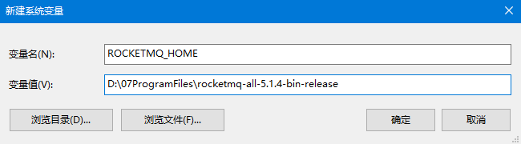
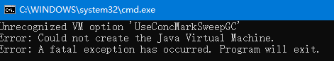
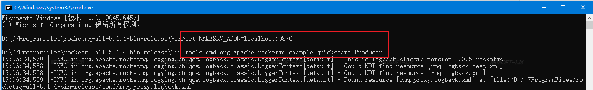
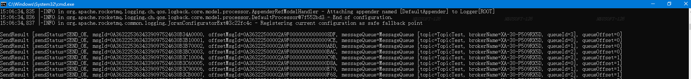
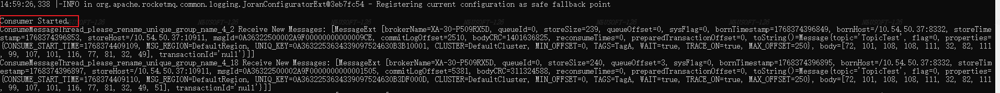

https://rocketmq.apache.org/zh/docs/

# 简介

RocketMQ 是一款**纯 Java 开发、分布式、高吞吐、高可靠、低延迟**的消息中间件，前身是阿里的 MetaQ，2016 年开源，2017 年成为 Apache 顶级项目，**主打分布式场景**，完美适配微服务架构。

## 产生背景

在阿里孕育 RocketMQ 的雏形时期，我们将其用于异步通信、搜索、社交网络活动流、数据管道，贸易流程中。随着我们的贸易业务吞吐量的上升，源自我们的消息传递集群的压力也变得紧迫。

根据我们的研究，随着队列和虚拟主题使用的增加，ActiveMQ IO模块达到了一个瓶颈。我们尽力通过节流、断路器或降级来解决这个问题，但效果并不理想。于是我们尝试了流行的消息传递解决方案Kafka。不幸的是，Kafka不能满足我们的要求，其尤其表现在低延迟和高可靠性方面，详见下文。在这种情况下，我们决定发明一个新的消息传递引擎来处理更广泛的消息用例，覆盖从传统的pub/sub场景到高容量的实时零误差的交易系统。

Apache RocketMQ 自诞生以来，因其架构简单、业务功能丰富、具备极强可扩展性等特点被众多企业开发者以及云厂商广泛采用。历经十余年的大规模场景打磨，RocketMQ 已经成为业内共识的金融级可靠业务消息首选方案，被广泛应用于互联网、大数据、移动互联网、物联网等领域的业务场景。

## 对比主流MQ

市面上主流 MQ：`RocketMQ`、`Kafka`、`RabbitMQ`，三者各有侧重，**RocketMQ 是「综合能力天花板」**，也是国内企业首选：

* ✅ **对比 Kafka**：Kafka 主打大数据日志传输、超高吞吐，但**事务消息、顺序消息、定时消息、死信队列**等企业级特性缺失；RocketMQ 吞吐接近 Kafka，同时补齐所有企业级特性，且运维更简单、单机稳定性更高。

* ✅ **对比 RabbitMQ**：RabbitMQ 基于 Erlang 开发，功能丰富，但**高吞吐场景性能不足、分布式集群扩展麻烦、海量消息堆积时容易 OOM**；RocketMQ 纯 Java 开发，和业务系统技术栈一致，集群扩展无缝，百万级消息堆积无压力。

* ✅ **核心优势**：**功能全、性能强、易运维、生态完善**，阿里内部经过双 11 超万亿消息量验证，生产环境绝对可靠。

## 应用场景

开发中 RocketMQ 的核心使用场景，几乎覆盖所有业务：

1. **异步解耦**：最核心场景！比如下单后「扣库存、减余额」同步执行，改为下单成功后发送 MQ 消息，库存 / 余额服务异步消费，**彻底解耦系统、削峰填谷、提升接口响应速度**。

2. **流量削峰**：秒杀 / 抢购场景，请求量瞬间暴增，MQ 承接所有请求，消费端按自身能力匀速消费，避免数据库被冲垮。

3. **日志归集**：分布式服务的日志，通过 MQ 异步发送到日志服务，统一存储分析。

4. **最终一致性**：分布式事务场景，通过**事务消息**保证跨服务的数据最终一致（替代复杂的 2PC）。

5. **广播通知**：一个消息需要被所有服务节点消费（比如配置更新、缓存刷新）。

6. **定时任务**：基于**延时消息**实现非精准定时任务（比如订单 30 分钟未支付自动关闭）。


# 安装部署

## Windows

* <span style="color: rgb(143,149,158); background-color: inherit">下载地址：</span><span style="color: rgb(143,149,158); background-color: inherit">https://rocketmq.apache.org/download</span>

* 环境变量配置

```shell
ROCKETMQ_HOME 
D:\07ProgramFiles\rocketmq-all-5.1.4-bin-release\bin
```



* <span style="color: rgb(143,149,158); background-color: inherit">启动name server</span>

<span style="color: rgb(143,149,158); background-color: inherit">打开 命令提示符 界面，进入自己的RocketMQ安装目录下的bin目录，输入下面命令启动 nameserver：</span>

```shell
start mqnamesrv.cmd
```

如下报错



RocketMQ 的启动脚本（`mqnamesrv`/`mqbroker`）中，**默认写死了 JVM 启动参数 `-XX:+UseConcMarkSweepGC`（CMS 垃圾回收器）**；

这个参数是 **JDK8 专属支持** 的，在 **JDK9、11、17、21 等高版本 JDK 中被彻底移除**；

找到 `bin` 目录下的 `runserver.cmd` 和 `runbroker.cmd` 两个文件，**用记事本 / Notepad++ 打开，分别修改**：

UseConcMarkSweepGC 修改为&#x20;

* <span style="color: rgb(143,149,158); background-color: inherit">启动broker</span>

```shell
start mqbroker.cmd -n 127.0.0.1:9876 autoCreateTopicEnable=true
```

## Linux

# 功能测试

## 启动消费者

<span style="color: rgb(143,149,158); background-color: inherit">打开cmd窗口，进入RocketMQ安装目录的bin目录，运行下面指令，启动消费者：</span>

<span style="color: rgb(143,149,158); background-color: inherit">RocketMQ自带了发送和接收消息的脚本 tools.cmd，用来验证RocketMQ的功能是否正常。</span>

```shell
set NAMESRV_ADDR=localhost:9876
tools.cmd org.apache.rocketmq.example.quickstart.Consumer
```

## <span style="color: rgb(143,149,158); background-color: inherit">启</span>动生产者

<span style="color: rgb(143,149,158); background-color: inherit">打开cmd窗口，进入RocketMQ安装目录的bin目录，运行下面指令，启动生产者：</span>

```shell
set NAMESRV_ADDR=localhost:9876
tools.cmd org.apache.rocketmq.example.quickstart.Producer
```



<span style="color: rgb(143,149,158); background-color: inherit">当生产者启动之后，会发送1000个消息，然后自动推出，当退出结束时会返回true：</span>



<span style="color: rgb(143,149,158); background-color: inherit">与此同时，消费者的窗口会开始接收生产者发送的消息，如下：</span>



<span style="color: rgb(143,149,158); background-color: inherit">表示RocketMQ功能正常启动。</span>

# <span style="color: rgb(143,149,158); background-color: inherit">插件部署</span>

## `rocketmq-console`

从 RocketMQ 4.9.0 版本开始，官方已经把 `rocketmq-console` 控制台模块从 `rocketmq-externals` 这个仓库中**彻底移除**了

https://github.com/apache/rocketmq-externals

## `rocketmq-dashboard`

官方把独立的 `rocketmq-console` 项目，**迁移并重命名**为：`rocketmq-dashboard`

https://github.com/apache/rocketmq-dashboard

<span style="color: rgb(143,149,158); background-color: inherit">解压完成之后，进入目录：rocketmq-externals/rocketmq-console/src/main/resources</span> <span style="color: rgb(143,149,158); background-color: inherit">找到 application.properties</span>

修改配置

```yaml
server.port=8081
rocketmq.config.namesrvAddr=127.0.0.1:9876
```

打包

mvn clean package '-Dmaven.test.skip=true'

java -jar rocketmq-console-ng-2.0.0.jar

## 控制台登录

<http://127.0.0.1:8082>

http://127.0.0.1:8083/

# 参考文档

https://cloud.tencent.com/developer/article/2484888

## Windows环境下RocketMQ的安装及配置（图文详解）

https://blog.csdn.net/weixin_43978412/article/details/113880980


## 项目源码地址

