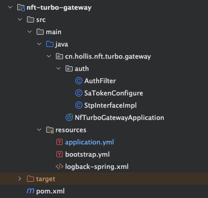
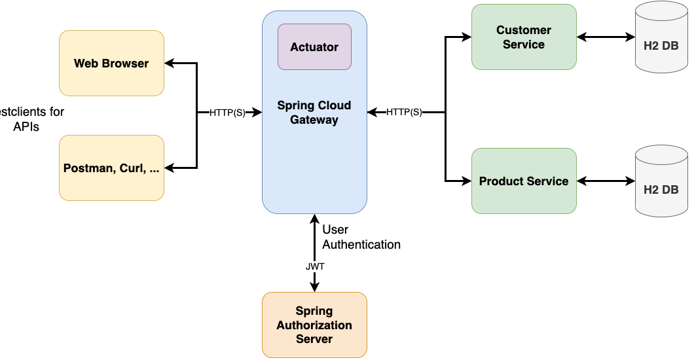

https://springdoc.cn/spring-cloud-gateway/

## ✅Gateway网关设计

在如今的SpringCloud生态中，SpringCloud Gateway是一个至关重要的组件。Spring Cloud Gateway 是一个在 Spring 生态系统中建立的 API 网关，**它为微服务架构中的服务提供了一个简单有效的方式来路由请求、转发和过滤等功能。**



网关的作用就是提供统一接入，意味着所有的流量都需要先经过网关，然后再由网关转发出去。




在我们的项目中，我们单独创建了一个应用（模块），就是我们的nft-turbo-gateway， 这个应用主要依赖了：

nft-turbo-config

​       配置中心组件，用于服务的发现，这样才能实现路由和负载均衡。

sa-token-reactor-spring-boot3-starter

​     Sa-Token相关依赖，因为我们要在网关中统一的鉴权。

spring-cloud-starter-loadbalancer

​     LoadBalancer，主要起到负载均衡的作用

sensitive-logback

​       用于日志脱敏

我们的 gateway应用中主要做的事情包含了这几个：

### 路由转发

Spring Cloud Gateway 允许我们定义路由规则，将进入的请求根据不同的路径或条件转发到不同的下游服务。这对于微服务架构中服务的管理和维护非常重要。

基于这个原理，我们就可以根据用户的不同请求，把用户路由到对应的服务中，比如用户要访问订单服务，则把他的请求直接路由给订单服务的集群，用户要访问商品服务，则把他的请求直接路由给商品服务的集群。

```
spring:
  cloud:
    gateway:
      routes:
        - id: nfturbo-auth
          uri: lb://nfturbo-auth
          predicates:
            - Path=/auth/**,/token/**
        - id: nfturbo-business
          uri: lb://nfturbo-business
          predicates:
            - Path=/trade/**,/order/**,/user/**,/collection/**,/wxPay/**
```


也就是说，我们把http 的请求路径中以`/auth/`和`/token/`开头的，路由到nfturbo-auth这个应用中，而其他的路径的请求则路由给 nfturbo-business 应用。

spring.cloud.gateway.routes：定义网关的路由规则。

- id: nfturbo-auth：这个路由的唯一标识符为 nfturbo-auth。
- uri: lb://nfturbo-auth：目标服务的 URI，使用负载均衡 (lb://) 来访问名为 nfturbo-auth 的服务。
- predicates: Path=/auth/**,/token/**：定义请求路径匹配规则。所有匹配 /auth/** 或 /token/** 的请求都会被转发到 nfturbo-auth 服务。

### 负载均衡

因为网关可以做路由转发，所以借助他也能实现非常方便的负载均衡。我们的项目中就是集成LoadBalancer实现的，如上面的配置中`uri: lb://nfturbo-auth`这部分的 `lb`其实就是起到了负载均衡的作用。

比如一个请求要访问auth模块，而auth这个应用我们可能搭建了集群，具体要路由给那台机器呢？这个就可以给予网关来实现负载均衡了。

### 统一鉴权

在我们的Gateway应用中，我们可以集成了OAuth2，来进行统一的登录和鉴权.

```
@Configuration
public class SaTokenConfigure {

    @Bean
    public SaReactorFilter getSaReactorFilter() {
        return new SaReactorFilter()
                // 拦截地址
                .addInclude("/**")
                // 开放地址
                .addExclude("/favicon.ico")
                // 鉴权方法：每次访问进入
                .setAuth(obj -> {
                    // 登录校验 -- 拦截所有路由，并排除/auth/login 用于开放登录
                    SaRouter.match("/**").notMatch("/auth/**", "/collection/collectionList", "/collection/collectionInfo", "/wxPay/**").check(r -> StpUtil.checkLogin());

                    // 权限认证 -- 不同模块, 校验不同权限
                    SaRouter.match("/admin/**", r -> StpUtil.checkRole(UserRole.ADMIN.name()));
                    SaRouter.match("/trade/**", r -> StpUtil.checkPermission(UserPermission.AUTH.name()));

                    SaRouter.match("/user/**", r -> StpUtil.checkPermission(UserPermission.BASIC.name()));
                    SaRouter.match("/orders/**", r -> StpUtil.checkPermission(UserPermission.BASIC.name()));

                })
                // 异常处理方法：每次setAuth函数出现异常时进入
                .setError(this::getSaResult);
    }
}
```

如以上配置，就是设置了访问哪些 url 需要登录，访问哪些url 需要对应的哪些权限等。

### 限流降级

我们还在Gateway中集成了Sentinel组件，来实现统一的限流。这样我们就可以在网关层面实现一个统一的流量管控，避免下游服务因为流程扛不住而被打挂。

这部分在限流内容处单独介绍。