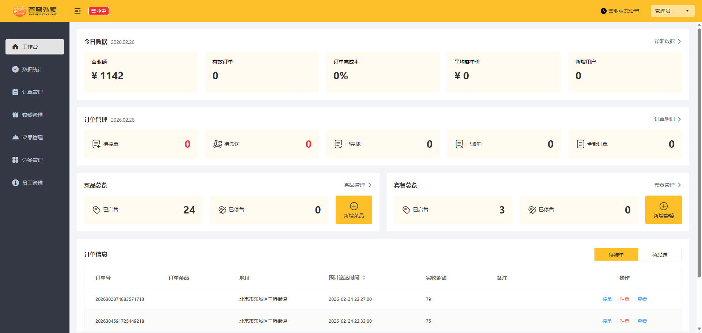
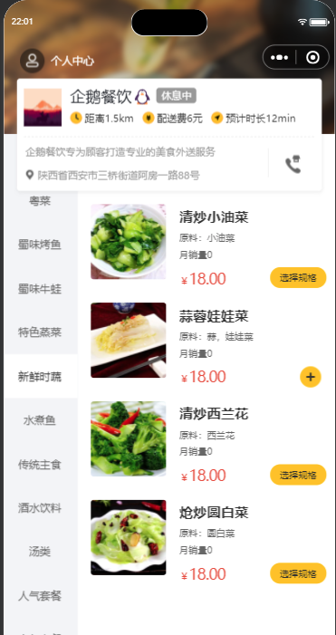

# zhuph-take-out

<p>
  <a href="https://gitee.com/zhuph/zhuph-take-out"></a>
</p>

## 前言

`zhuph-take-out`项目主要用于个人的学习使用。

## 项目文档

文档地址：[https://www.zhuph.takeout.com](https://www.zhuph.takeout.com)

## 项目介绍

该外卖系统是根据**苍穹外卖**进行学习的记录，资料主要来源于互联网，其中也加入一些个人的修改。

```lua
zhuph-take-out
├── docs -- 文档资料
├── take-out -- 后台管理系统的后端工程
├── take-out-web -- 后台管理系统的前端工程
├── take-out-weixin -- 外卖系统的小程序
└── README.md -- 项目文档
```

## 项目演示

### 后台管理系统（服务端）

访问地址 http://localhost:8888/#/login



### 小程序（客户端）




## 技术选型

### 后端技术

| 技术           | 说明            | 官网                                           |
| -------------- | --------------- | ---------------------------------------------- |
| SpringBoot     | Web应用开发框架 | https://spring.io/projects/spring-boot         |
| SpringSecurity | 认证和授权框架  | https://spring.io/projects/spring-security     |
| MyBatis        | ORM框架         | http://www.mybatis.org/mybatis-3/zh/index.html |

### 前端技术

| 技术       | 说明                  | 官网                                     |
| ---------- | --------------------- | ---------------------------------------- |
| Vue        | 前端框架              | <https://vuejs.org/>                     |
| Vue-router | 路由框架              | <https://router.vuejs.org/>              |
| Vuex       | 全局状态管理框架      | <https://vuex.vuejs.org/>                |
| Element    | 前端UI框架            | <https://element.eleme.io>               |
| Axios      | 前端HTTP框架          | <https://github.com/axios/axios>         |
| v-charts   | 基于Echarts的图表框架 | <https://v-charts.js.org/>               |
| Js-cookie  | cookie管理工具        | <https://github.com/js-cookie/js-cookie> |
| nprogress  | 进度条控件            | <https://github.com/rstacruz/nprogress>  |

### 移动端技术

| 技术         | 说明             | 官网                                      |
| ------------ | ---------------- | ----------------------------------------- |
| Vue          | 核心前端框架     | <https://vuejs.org>                       |
| Vuex         | 全局状态管理框架 | <https://vuex.vuejs.org>                  |
| uni-app      | 移动端前端框架   | <https://uniapp.dcloud.io>                |
| mix-mall     | 电商项目模板     | <https://ext.dcloud.net.cn/plugin?id=200> |
| luch-request | HTTP请求框架     | <https://github.com/lei-mu/luch-request>  |

## 软件架构

### 系统架构


### 业务架构


## 环境搭建

1. 启动redis

   Redis-x64-5.0.14

   ```shell
   .\redis-server.exe redis.windows.conf
   ```

2. 启动minio

   ```shell
   .\minio.exe server D:\ProgramFiles\minio\data --console-address "127.0.0.1:9001"
   ```

3. 启动后端工程

   jdk-11.0.2

   API文档 http://localhost:8080/doc.html

4. 启动前端工程

   node 16.20.2

   http://localhost:8888/#/login

5. 启动微信小程序

## 使用说明

1.  xxxx
2.  xxxx
3.  xxxx

## 参与贡献

1.  Fork 本仓库
2.  新建 Feat_xxx 分支
3.  提交代码
4.  新建 Pull Request

## 特技

1.  使用 Readme\_XXX.md 来支持不同的语言，例如 Readme\_en.md, Readme\_zh.md
2.  Gitee 官方博客 [blog.gitee.com](https://blog.gitee.com)
3.  你可以 [https://gitee.com/explore](https://gitee.com/explore) 这个地址来了解 Gitee 上的优秀开源项目
4.  [GVP](https://gitee.com/gvp) 全称是 Gitee 最有价值开源项目，是综合评定出的优秀开源项目
5.  Gitee 官方提供的使用手册 [https://gitee.com/help](https://gitee.com/help)
6.  Gitee 封面人物是一档用来展示 Gitee 会员风采的栏目 [https://gitee.com/gitee-stars/](https://gitee.com/gitee-stars/)
